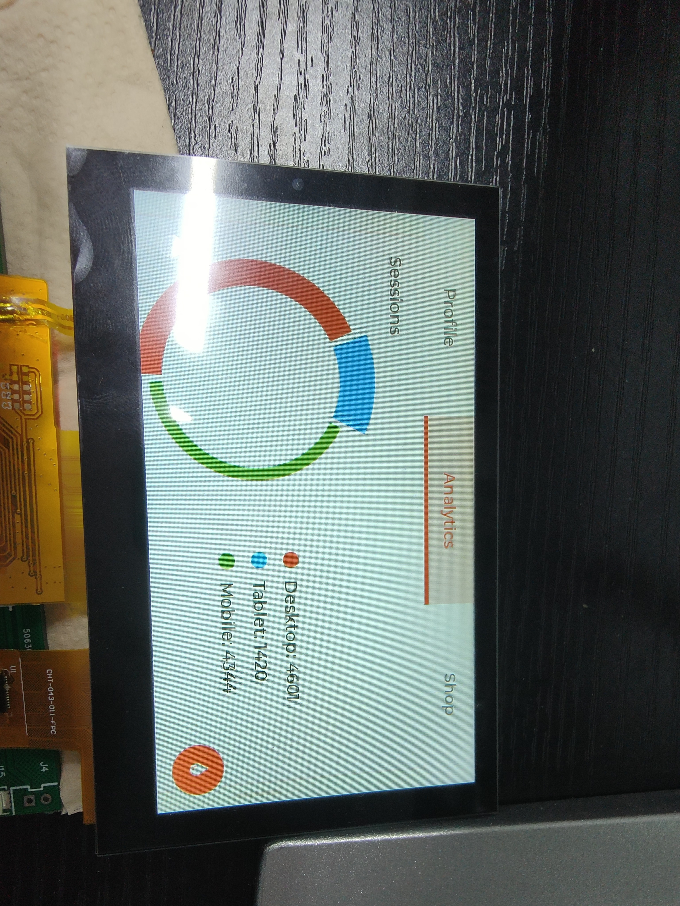
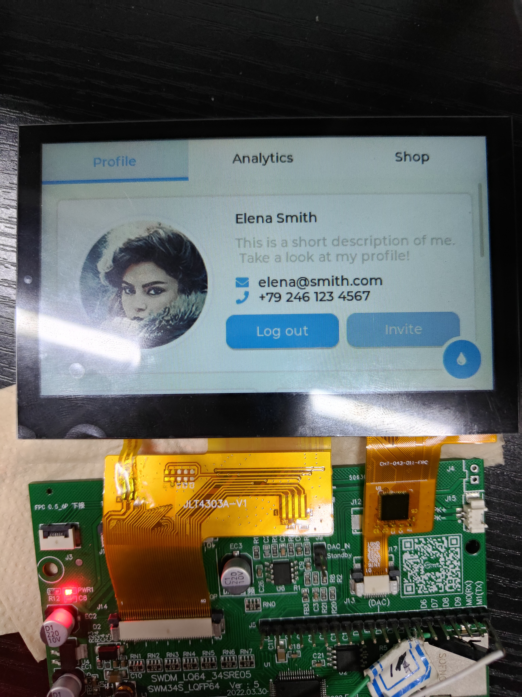

## 环境

- 开发环境：Platformio
- 芯片： SWM341SRE
- 下载：JlinkV9

## 使用方法

1. 安装`platformio`

2. 安装`synwit`支持包 :

   ```bash
   pio platform install https://github.com/hysonglet/platformio_synwit.git
   ```

3. 拷贝测试程序

   ```bash
   cp ~/.platformio/platforms/synwit/examples/spl/lcd ~/Desktop/ -r
   cd ~/Desktop/lcd/lvgl
   ```

4. 编译:`pio run`

5. 编译或下载:`pio run -t upload` 

## 测试结果





流畅度详细请查看：`doc/测试.mp4`
